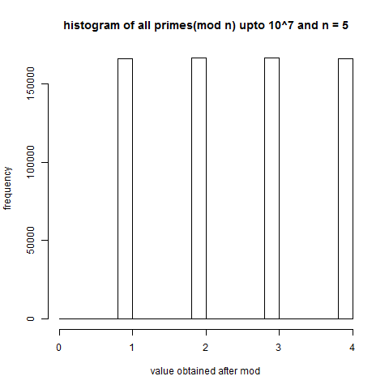
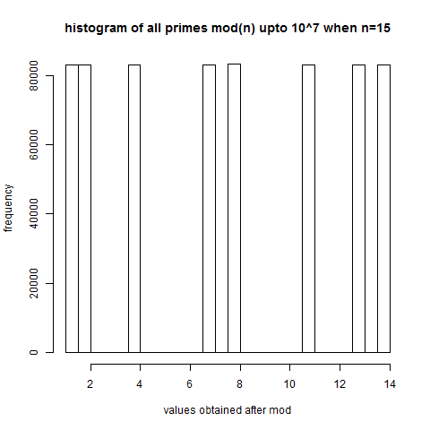
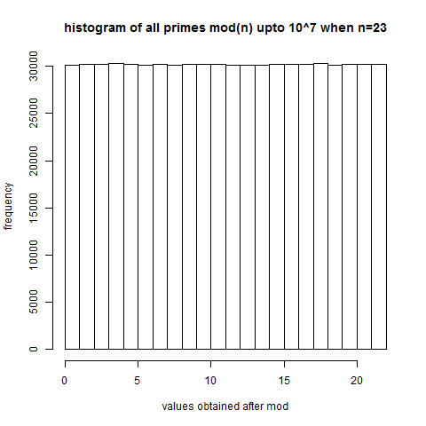
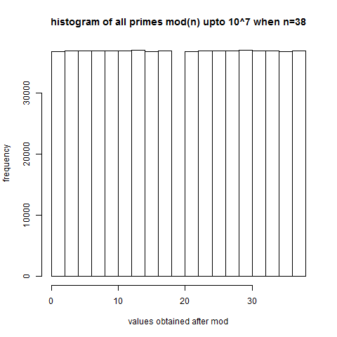
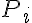
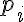

Math 490 hw Problem 2
==================

Following are the histograms of all primes utpo 10^7 moded with n. 

We have four cases where n = 5,15,23,38 respectively

### N = 5

### N = 15

### N = 23

### N = 38
	

			
****

From the above histograms, we can see that values obtained after moding any prime with N  have nearly equal frequencies for primes
upto 10^7. 

This means that there exists a set   where each
 is a set of primes, such that all elements in this set when moded with N yield the same remainder.

We can also conclude that conversely, for any N there exists a set P as descirbes above, where
 in P contains infinitely many primes such that all primes in 
when moded with N yield the same number. 

Hence, there are infinitely many primes that make up infinitely many subsets of the type 
representing the congruency of all  in  when any 
is moded with N

